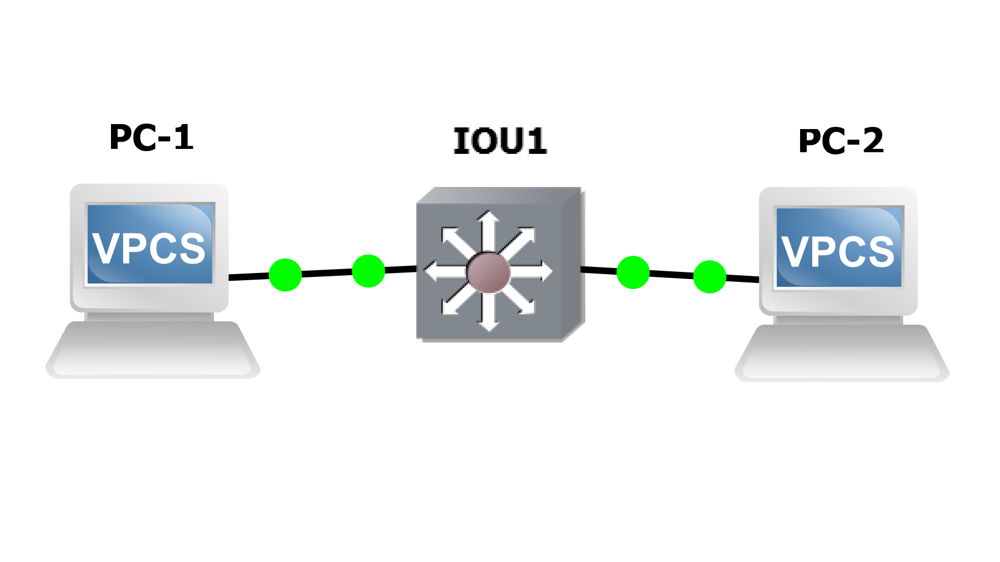
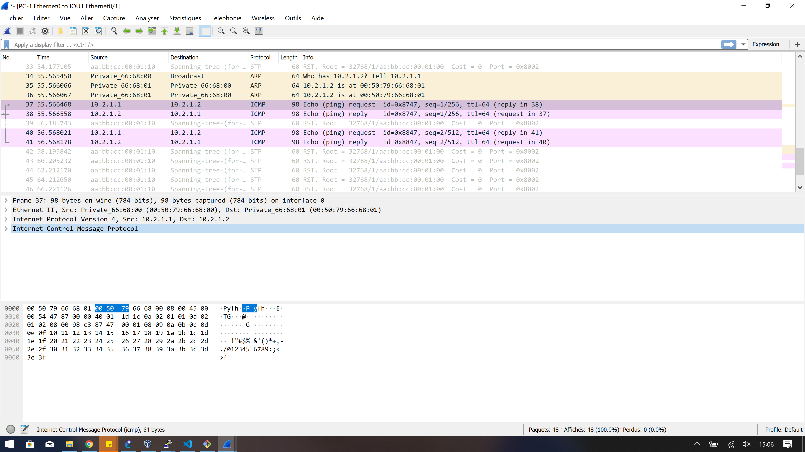
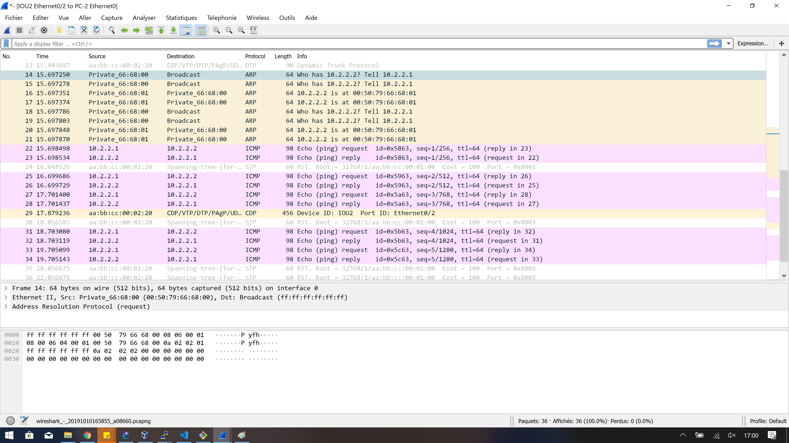

# TP2 : Network low-level, Switching

# I. Simplest setup

#### Topologie

```
+-----+        +-------+        +-----+
| PC1 +--------+  SW1  +--------+ PC2 |
+-----+        +-------+        +-----+
```

#### Plan d'adressage

Machine | `net1`
--- | ---
`PC1` | `10.2.1.1/24`
`PC2` | `10.2.1.2/24`

#### ToDo

* 🌞 mettre en place la topologie ci-dessus

* 🌞 faire communiquer les deux PCs

  * `ping 10.2.1.2`:  
  Protocole utilisé : ICMP (Internet Control Message Protocol)
  * `ping 10.2.1.1`:  
  protocole utilisé: ICMP (Internet Control Message Protocol)
  * analyser les échanges ARP :
    ```
    34	55.565450	Private_66:68:00	Broadcast	ARP (request)	64	Who has 10.2.1.2? Tell 10.2.1.1
    35	55.566066	Private_66:68:01	Private_66:68:00	ARP (reply)	64	10.2.1.2 is at 00:50:79:66:68:01
    36	55.566067	Private_66:68:01	Private_66:68:00	ARP	(reply) 64	10.2.1.2 is at 00:50:79:66:68:01
    ```

  * corréler avec les tables ARP des différentes machines
    ```bash
    PC-1> arp
    00:50:79:66:68:00  10.2.1.2 expires in 113 seconds
    ```
    ```bash
    PC-2> arp
    00:50:79:66:68:01  10.2.1.1 expires in 84 seconds
    ```

* 🌞 récapitulatif de toutes les étapes quand PC1 exécute ping PC2 pour la première fois :
  * échanges ARP
  Quand le PC1 ping le PC2 pour la première fois, 3 lignes ARP s'affichent dans le Wireshark : 1 request et 2 reply. Le protocole ARP permet de récupérer l'addresse Mac du PC2 pour pouvoir communiquer avec lui.
  Request = la demande du PC1 vers le PC2
  Reply = la réponse du PC2 vers le PC1
* échange ping  
  L'échange de ping utilise le protocole utilisé est ICMP
* 🌞 expliquer...
  * pourquoi le switch n'a pas besoin d'IP
    
    Car il transmet juste les messages  
    

  * pourquoi les machines ont besoin d'une IP pour pouvoir se ping
    
    Pour savoir à qui distribuer les paquets
    

# II. More switches

#### Topologie

```
                        +-----+
                        | PC2 |
                        +--+--+
                           |
                           |
                       +---+---+
                   +---+  SW2  +----+
                   |   +-------+    |
                   |                |
                   |                |
+-----+        +---+---+        +---+---+        +-----+
| PC1 +--------+  SW1  +--------+  SW3  +--------+ PC3 |
+-----+        +-------+        +-------+        +-----+
```

#### Plan d'adressage

Machine | `net1`
--- | ---
`PC1` | `10.2.2.1/24`
`PC2` | `10.2.2.2/24`
`PC3` | `10.2.2.3/24`

#### ToDo

* 🌞 faire communiquer les trois PCs
  * `ping` PC1 à PC2 et PC3 :
  ```bash
  PC-1> ping 10.2.2.2
  84 bytes from 10.2.2.2 icmp_seq=1 ttl=64 time=0.266 ms
  84 bytes from 10.2.2.2 icmp_seq=2 ttl=64 time=0.303 ms
  ^C
  PC-1> ping 10.2.2.3
  84 bytes from 10.2.2.3 icmp_seq=1 ttl=64 time=0.336 ms
  84 bytes from 10.2.2.3 icmp_seq=2 ttl=64 time=0.877 ms
  ```
  * `ping` PC2 à PC1 et PC3 :
  ```bash
  PC-2> ping 10.2.2.1
  84 bytes from 10.2.2.1 icmp_seq=1 ttl=64 time=0.166 ms
  84 bytes from 10.2.2.1 icmp_seq=2 ttl=64 time=0.261 ms
  ^C
  PC-2> ping 10.2.2.3
  84 bytes from 10.2.2.3 icmp_seq=1 ttl=64 time=0.391 ms
  84 bytes from 10.2.2.3 icmp_seq=2 ttl=64 time=0.456 ms
  ```
  * `ping` PC3 à PC1 et PC2 :
  ```bash
  PC-3> ping 10.2.2.2
  84 bytes from 10.2.2.2 icmp_seq=1 ttl=64 time=0.255 ms
  84 bytes from 10.2.2.2 icmp_seq=2 ttl=64 time=0.348 ms
  ^C
  PC-3> ping 10.2.2.1
  84 bytes from 10.2.2.1 icmp_seq=1 ttl=64 time=0.204 ms
  84 bytes from 10.2.2.1 icmp_seq=2 ttl=64 time=0.319 ms
  ```
* 🌞 analyser la table MAC d'un switch
  * `show mac address-table` switch1 :
  ```bash
  IOU1#show mac address-table
            Mac Address Table
  -------------------------------------------

  Vlan    Mac Address       Type        Ports
  ----    -----------       --------    -----
    1    aabb.cc00.0230    DYNAMIC     Et0/3
    1    aabb.cc00.0301    DYNAMIC     Et0/3
    1    aabb.cc00.0320    DYNAMIC     Et0/2
  Total Mac Addresses for this criterion: 3
  ```
  * comprendre/expliquer chaque ligne
* 🐙 en lançant Wireshark sur les liens des switches, il y a des trames CDP qui circulent. Quoi qu'est-ce ?
C'est le Cisco Discovery Protocol.

#### Mise en évidence du Spanning Tree Protocol

STP a été ici automatiquement configuré par les switches eux-mêmes pour éviter une boucle réseau. 

Dans une configuration pareille, les switches ont élu un chemin de préférence.  
Si on considère les trois liens qui unissent les switches :
* `SW1` <> `SW2`
* `SW2` <> `SW3`
* `SW1` <> `SW3`  

**L'un de ces liens a forcément été désactivé.**

On va regarder comment STP a été configuré.

* 🌞 déterminer les informations STP
```bash
IOU1#show spanning-tree

VLAN0001
  Spanning tree enabled protocol rstp
  Root ID    Priority    32769
             Address     aabb.cc00.0100
             This bridge is the root
             Hello Time   2 sec  Max Age 20 sec  Forward Delay 15 sec

  Bridge ID  Priority    32769  (priority 32768 sys-id-ext 1)
             Address     aabb.cc00.0100
             Hello Time   2 sec  Max Age 20 sec  Forward Delay 15 sec
             Aging Time  300 sec

Interface           Role Sts Cost      Prio.Nbr Type
------------------- ---- --- --------- -------- --------------------------------
Et0/0               Desg FWD 100       128.1    Shr
Et0/1               Desg FWD 100       128.2    Shr
Et0/2               Desg FWD 100       128.3    Shr
Et0/3               Desg FWD 100       128.4    Shr
Et1/0               Desg FWD 100       128.5    Shr
Et1/1               Desg FWD 100       128.6    Shr
Et1/2               Desg FWD 100       128.7    Shr
Et1/3               Desg FWD 100       128.8    Shr
Et2/0               Desg FWD 100       128.9    Shr
Et2/1               Desg FWD 100       128.10   Shr
Et2/2               Desg FWD 100       128.11   Shr
Et2/3               Desg FWD 100       128.12   Shr
Et3/0               Desg FWD 100       128.13   Shr
Et3/1               Desg FWD 100       128.14   Shr
Et3/2               Desg FWD 100       128.15   Shr
Et3/3               Desg FWD 100       128.16   Shr

IOU1#show spanning-tree bridge

                                                   Hello  Max  Fwd
Vlan                         Bridge ID              Time  Age  Dly  Protocol
---------------- --------------------------------- -----  ---  ---  --------
VLAN0001         32769 (32768,   1) aabb.cc00.0100    2    20   15  rstp
IOU1#show spanning-tree summary
Switch is in rapid-pvst mode
Root bridge for: VLAN0001
Extended system ID                      is enabled
Portfast Default                        is disabled
Portfast Edge BPDU Guard Default        is disabled
Portfast Edge BPDU Filter Default       is disabled
Loopguard Default                       is disabled
PVST Simulation Default                 is enabled but inactive in rapid-pvst mode
Bridge Assurance                        is enabled
EtherChannel misconfig guard            is enabled
Configured Pathcost method used is short
UplinkFast                              is disabled
BackboneFast                            is disabled

Name                   Blocking Listening Learning Forwarding STP Active
---------------------- -------- --------- -------- ---------- ----------
VLAN0001                     0         0        0         16         16
---------------------- -------- --------- -------- ---------- ----------
1 vlan                       0         0        0         16         16
```
* 🌞 faire un schéma en représentant les informations STP
  * rôle des switches (qui est le root bridge)
  * rôle de chacun des ports
* 🌞 confirmer les informations STP

  * vérifier que les trames passent bien par le chemin attendu (Wireshark)
* 🌞 ainsi, déterminer quel lien a été désactivé par STP
* 🌞 faire un schéma qui explique le trajet d'une requête ARP lorsque PC1 ping PC3, et de sa réponse
  * représenter **TOUTES** les trames ARP (n'oubliez pas les broadcasts)

#### Reconfigurer STP

* 🌞 changer la priorité d'un switch qui n'est pas le *root bridge*
* 🌞 vérifier les changements
  * avec des commandes sur les switches
  * 🐙 capturer les échanges qui suivent une reconfiguration STP avec Wireshark

#### 🐙 STP & Perfs

Si vous avez lancé Wireshark sur un lien entre un PC et un Switch, vous avez vu qu'il y a toujours des trames STP qui circulent...
* un peu con non ? C'est un PC, il enverra jamais de trames STP
* aussi avec STP, quand on branche un PC, le lien mettra plusieurs secondes avant de passer en *forwarding* et ainsi transmettre de la donnée
* l'idéal ça serait de désactiver l'envoi de trames STP sur l'interface du switch (ça évite de cramer de la bande passante et du calcul CPU pour rien, générer du trafic inutile, etc.)
* sauuuuf que si un p'tit malin branche des switches là-dessus, il pourrait tout péter en créant une boucle
* deux fonctionnalités à mettre en place : 
  * `portfast` : marque un port comme *"edge"* dans la topologie STP. Un port *edge* est considéré comme une extrémité de la topologie (= un client branché dessus, port *access*). *Port**fast*** parce que ça va permettre au port de s'allumer plus rapidement (sans passer par les états *listening* et *learning* pendant 15 secondes chacun par défaut) et d'être disponible instantanément
    * on peut voir l'état d'un port (forward, listening, learning, blocking avec `show spanning-tree vlan 1`)
  * `bpduguard` : permet de shutdown le port s'il reçoit des *BPDU* (pour rappel : un *BPDU* c'est un message STP)  
  
Idem pour les trames CDP !

🐙 ToDo :
  * [activer ces fonctionnalités (*portfast* et *bpduguard*) et activer le filtre BPDU](/memo/cli-cisco.md#stp) sur les interfaces où c'est nécessaire (marqué comme *edge* dans la topologie STP)
  * aussi [désactiver l'envoi de trames CDP](/memo/cli-cisco.md#cdp) sur ces ports
    * prouver avec Wireshark que le switch n'envoie plus de BPDU ni de trames CDP
    * faites une capture avant et une capture après les manips pour le prouver :)

# III. Isolation

## 1. Simple
 
#### Topologie
```
+-----+        +-------+        +-----+
| PC1 +--------+  SW1  +--------+ PC3 |
+-----+      10+-------+20      +-----+
                 20|
                   |
                +--+--+
                | PC2 |
                +-----+
```

#### Plan d'adressage

Machine | IP `net1` | VLAN
--- | --- | --- 
`PC1` | `10.2.3.1/24` | 10
`PC2` | `10.2.3.2/24` | 20
`PC3` | `10.2.3.3/24` | 20

#### ToDo

* 🌞 mettre en place la topologie ci-dessus
  * voir [les commandes dédiées à la manipulation de VLANs](/memo/cli-cisco.md#vlan)
* 🌞 faire communiquer les PCs deux à deux
  * vérifier que `PC2` ne peut joindre que `PC3`
  * vérifier que `PC1` ne peut joindre personne alors qu'il est dans le même réseau (sad)

## 2. Avec trunk

#### Topologie

```
+-----+        +-------+        +-------+        +-----+
| PC1 +--------+  SW1  +--------+  SW2  +--------+ PC4 |
+-----+      10+-------+        +-------+20      +-----+
                 20|              10|
                   |                |
                +--+--+          +--+--+
                | PC2 |          | PC3 |
                +-----+          +-----+
```

#### Plan d'adressage

Machine | IP `net1` | IP `net2` | VLAN
--- | --- | --- | ---
`PC1` | `10.2.10.1/24` | X | 10
`PC2` | X | `10.2.20.1/24` | 20
`PC3` | `10.2.10.2/24` | X | 10
`PC4` | X | `10.2.20.2/24` | 20

#### ToDo

* 🌞 mettre en place la topologie ci-dessus
* 🌞 faire communiquer les PCs deux à deux
  * vérifier que `PC1` ne peut joindre que `PC3`
  * vérifier que `PC4` ne peut joindre que `PC2`
* 🌞 mettre en évidence l'utilisation des VLANs avec Wireshark

# IV. Need perfs

#### Topologie

Pareil qu'en [III.2.](#2-avec-trunk) à part le lien entre SW1 et SW2 qui est doublé.

```
+-----+        +-------+--------+-------+        +-----+
| PC1 +--------+  SW1  |        |  SW2  +--------+ PC4 |
+-----+      10+-------+--------+-------+20      +-----+
                 20|              10|
                   |                |
                +--+--+          +--+--+
                | PC2 |          | PC3 |
                +-----+          +-----+

```
#### Plan d'adressage

Pareil qu'en [III.2.](#2-avec-trunk).

Machine | IP `net1` | IP `net2` | VLAN
--- | --- | --- | ---
`PC1` | `10.2.10.1/24` | X | 10
`PC2` | X | `10.2.20.1/24` | 20
`PC3` | `10.2.10.2/24` | X | 10
`PC4` | X | `10.2.20.2/24` | 20

#### ToDo

* 🌞 mettre en place la topologie ci-dessus
  * configurer LACP entre `SW1` et `SW2`
  * utiliser Wireshark pour mettre en évidence l'utilisation de trames LACP
  * **vérifier avec un `show ip interface po1` que la bande passante a bien été doublée**

> Pas de failover possible sur les IOUs malheureusement :( (voir [ce doc](https://www.cisco.com/c/en/us/td/docs/switches/blades/3020/software/release/12-2_58_se/configuration/guide/3020_scg/swethchl.pdf), dernière section. Pas de link state dans les IOUs)