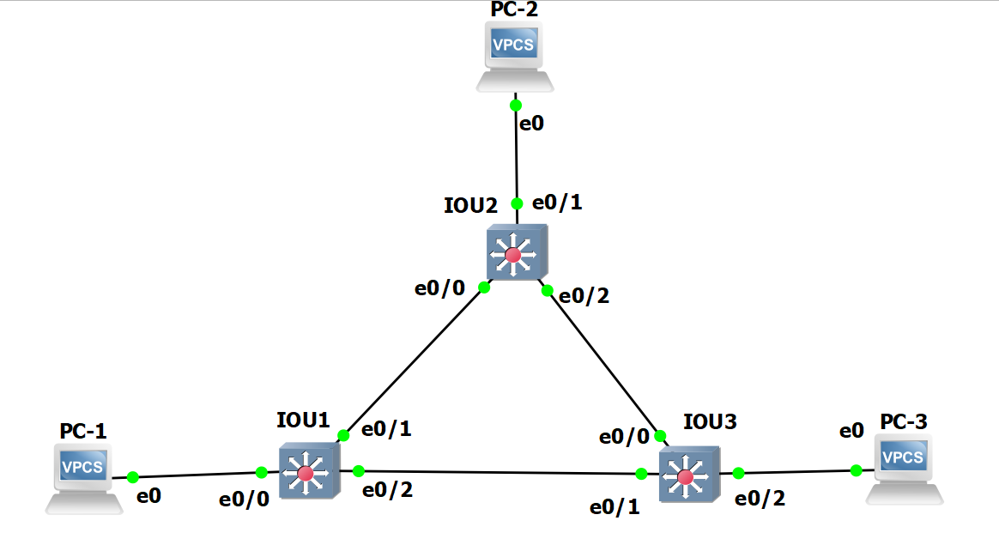
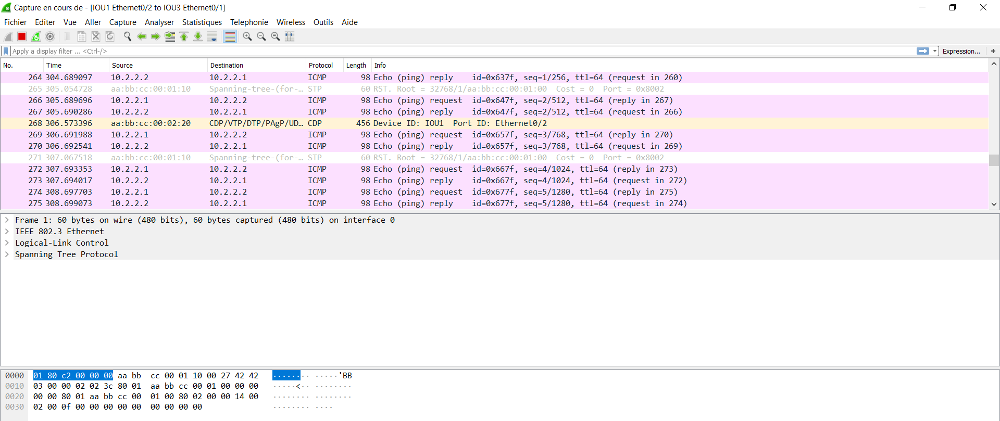
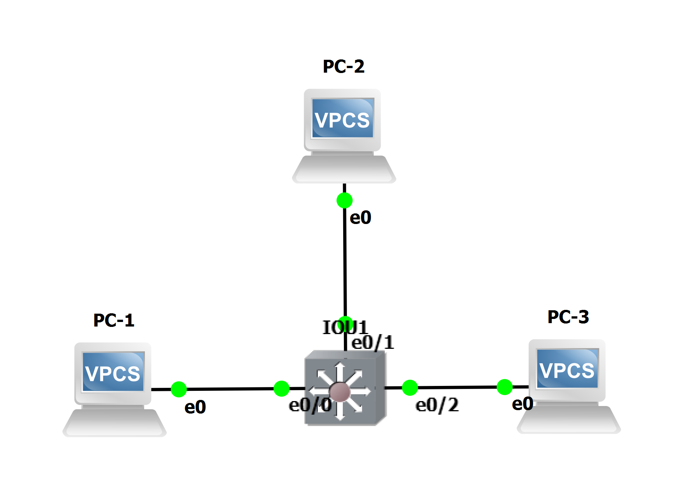
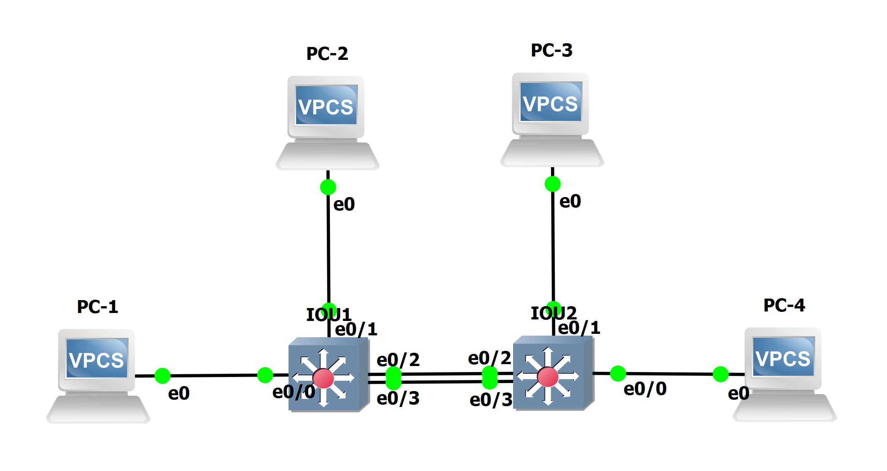

# TP2 : Network low-level, Switching

# I. Simplest setup

#### Topologie

```
+-----+        +-------+        +-----+
| PC1 +--------+  SW1  +--------+ PC2 |
+-----+        +-------+        +-----+
```

#### Plan d'adressage

Machine | `net1`
--- | ---
`PC1` | `10.2.1.1/24`
`PC2` | `10.2.1.2/24`

#### ToDo

* 🌞 mettre en place la topologie ci-dessus

* 🌞 faire communiquer les deux PCs

  * `ping 10.2.1.2`:  
  Protocole utilisé : ICMP (Internet Control Message Protocol)
  * `ping 10.2.1.1`:  
  protocole utilisé: ICMP (Internet Control Message Protocol)
  * analyser les échanges ARP :
    ```
    34	55.565450	Private_66:68:00	Broadcast	ARP (request)	64	Who has 10.2.1.2? Tell 10.2.1.1
    35	55.566066	Private_66:68:01	Private_66:68:00	ARP (reply)	64	10.2.1.2 is at 00:50:79:66:68:01
    36	55.566067	Private_66:68:01	Private_66:68:00	ARP	(reply) 64	10.2.1.2 is at 00:50:79:66:68:01
    ```

  * corréler avec les tables ARP des différentes machines
    ```bash
    PC-1> arp
    00:50:79:66:68:00  10.2.1.2 expires in 113 seconds
    ```
    ```bash
    PC-2> arp
    00:50:79:66:68:01  10.2.1.1 expires in 84 seconds
    ```

* 🌞 récapitulatif de toutes les étapes quand PC1 exécute ping PC2 pour la première fois :
  * échanges ARP
  Quand le PC1 ping le PC2 pour la première fois, 3 lignes ARP s'affichent dans le Wireshark : 1 request et 2 reply. Le protocole ARP permet de récupérer l'addresse Mac du PC2 pour pouvoir communiquer avec lui.
  Request = la demande du PC1 vers le PC2
  Reply = la réponse du PC2 vers le PC1
* échange ping  
  L'échange de ping utilise le protocole utilisé est ICMP
* 🌞 expliquer...
  * pourquoi le switch n'a pas besoin d'IP
    
    Car il transmet juste les messages  
    

  * pourquoi les machines ont besoin d'une IP pour pouvoir se ping
    
    Pour savoir à qui distribuer les paquets
    

# II. More switches

#### Topologie

```
                        +-----+
                        | PC2 |
                        +--+--+
                           |
                           |
                       +---+---+
                   +---+  SW2  +----+
                   |   +-------+    |
                   |                |
                   |                |
+-----+        +---+---+        +---+---+        +-----+
| PC1 +--------+  SW1  +--------+  SW3  +--------+ PC3 |
+-----+        +-------+        +-------+        +-----+
```

#### Plan d'adressage

Machine | `net1`
--- | ---
`PC1` | `10.2.2.1/24`
`PC2` | `10.2.2.2/24`
`PC3` | `10.2.2.3/24`

#### ToDo

* 🌞 faire communiquer les trois PCs
  * `ping` PC1 à PC2 et PC3 :
  ```bash
  PC-1> ping 10.2.2.2
  84 bytes from 10.2.2.2 icmp_seq=1 ttl=64 time=0.266 ms
  84 bytes from 10.2.2.2 icmp_seq=2 ttl=64 time=0.303 ms
  ^C
  PC-1> ping 10.2.2.3
  84 bytes from 10.2.2.3 icmp_seq=1 ttl=64 time=0.336 ms
  84 bytes from 10.2.2.3 icmp_seq=2 ttl=64 time=0.877 ms
  ```
  * `ping` PC2 à PC1 et PC3 :
  ```bash
  PC-2> ping 10.2.2.1
  84 bytes from 10.2.2.1 icmp_seq=1 ttl=64 time=0.166 ms
  84 bytes from 10.2.2.1 icmp_seq=2 ttl=64 time=0.261 ms
  ^C
  PC-2> ping 10.2.2.3
  84 bytes from 10.2.2.3 icmp_seq=1 ttl=64 time=0.391 ms
  84 bytes from 10.2.2.3 icmp_seq=2 ttl=64 time=0.456 ms
  ```
  * `ping` PC3 à PC1 et PC2 :
  ```bash
  PC-3> ping 10.2.2.2
  84 bytes from 10.2.2.2 icmp_seq=1 ttl=64 time=0.255 ms
  84 bytes from 10.2.2.2 icmp_seq=2 ttl=64 time=0.348 ms
  ^C
  PC-3> ping 10.2.2.1
  84 bytes from 10.2.2.1 icmp_seq=1 ttl=64 time=0.204 ms
  84 bytes from 10.2.2.1 icmp_seq=2 ttl=64 time=0.319 ms
  ```
* 🌞 analyser la table MAC d'un switch
  * `show mac address-table` switch1 :
  ```bash
  IOU1#show mac address-table
          Mac Address Table
  -------------------------------------------

  Vlan    Mac Address       Type        Ports
  ----    -----------       --------    -----
    1    0050.7966.6800    DYNAMIC     Et0/1
    1    0050.7966.6801    DYNAMIC     Et0/3
    1    0050.7966.6802    DYNAMIC     Et0/2
    1    aabb.cc00.0230    DYNAMIC     Et0/3
    1    aabb.cc00.0301    DYNAMIC     Et0/3
    1    aabb.cc00.0320    DYNAMIC     Et0/2
  Total Mac Addresses for this criterion: 6
  ```
  En faisant show mac address-table on voit les machines qui sont connectées à ce switch.
  On voit aussi les deux autres switch du réseau avec les machines de chacun (avec leur MAC adresse).
* 🐙 en lançant Wireshark sur les liens des switches, il y a des trames CDP qui circulent. Quoi qu'est-ce ?
C'est le Cisco Discovery Protocol.

#### Mise en évidence du Spanning Tree Protocol

STP a été ici automatiquement configuré par les switches eux-mêmes pour éviter une boucle réseau. 

Dans une configuration pareille, les switches ont élu un chemin de préférence.  
Si on considère les trois liens qui unissent les switches :
* `SW1` <> `SW2`
* `SW2` <> `SW3`
* `SW1` <> `SW3`  

**L'un de ces liens a forcément été désactivé.**

On va regarder comment STP a été configuré.

* 🌞 déterminer les informations STP
  ```bash
  IOU1#show spanning-tree

  VLAN0001
    Spanning tree enabled protocol rstp
    Root ID    Priority    32769
              Address     aabb.cc00.0100
              This bridge is the root
              Hello Time   2 sec  Max Age 20 sec  Forward Delay 15 sec

    Bridge ID  Priority    32769  (priority 32768 sys-id-ext 1)
              Address     aabb.cc00.0100
              Hello Time   2 sec  Max Age 20 sec  Forward Delay 15 sec
              Aging Time  300 sec

  Interface           Role Sts Cost      Prio.Nbr Type
  ------------------- ---- --- --------- -------- --------------------------------
  Et0/0               Desg FWD 100       128.1    Shr
  Et0/1               Desg FWD 100       128.2    Shr
  Et0/2               Desg FWD 100       128.3    Shr
  Et0/3               Desg FWD 100       128.4    Shr
  Et1/0               Desg FWD 100       128.5    Shr
  Et1/1               Desg FWD 100       128.6    Shr
  Et1/2               Desg FWD 100       128.7    Shr
  Et1/3               Desg FWD 100       128.8    Shr
  Et2/0               Desg FWD 100       128.9    Shr
  Et2/1               Desg FWD 100       128.10   Shr
  Et2/2               Desg FWD 100       128.11   Shr
  Et2/3               Desg FWD 100       128.12   Shr
  Et3/0               Desg FWD 100       128.13   Shr
  Et3/1               Desg FWD 100       128.14   Shr
  Et3/2               Desg FWD 100       128.15   Shr
  Et3/3               Desg FWD 100       128.16   Shr

  IOU1#show spanning-tree bridge

                                                    Hello  Max  Fwd
  Vlan                         Bridge ID              Time  Age  Dly  Protocol
  ---------------- --------------------------------- -----  ---  ---  --------
  VLAN0001         32769 (32768,   1) aabb.cc00.0100    2    20   15  rstp
  IOU1#show spanning-tree summary
  Switch is in rapid-pvst mode
  Root bridge for: VLAN0001
  Extended system ID                      is enabled
  Portfast Default                        is disabled
  Portfast Edge BPDU Guard Default        is disabled
  Portfast Edge BPDU Filter Default       is disabled
  Loopguard Default                       is disabled
  PVST Simulation Default                 is enabled but inactive in rapid-pvst mode
  Bridge Assurance                        is enabled
  EtherChannel misconfig guard            is enabled
  Configured Pathcost method used is short
  UplinkFast                              is disabled
  BackboneFast                            is disabled

  Name                   Blocking Listening Learning Forwarding STP Active
  ---------------------- -------- --------- -------- ---------- ----------
  VLAN0001                     0         0        0         16         16
  ---------------------- -------- --------- -------- ---------- ----------
  1 vlan                       0         0        0         16         16
  ```
* 🌞 faire un schéma en représentant les informations STP

* 🌞 confirmer les informations STP  
IOU1 vers IOU2 le protocole STP a désactivé le lien.

En regardant les autres liaisons on voit que la trame passe du switch 1 au switch 3 puis du switch 3 au switch 2 pour aller au PC2.


* 🌞 faire un schéma qui explique le trajet d'une requête ARP lorsque PC1 ping PC3, et de sa réponse


#### Reconfigurer STP

* 🌞 changer la priorité d'un switch qui n'est pas le *root bridge*
On donne la priorité au IOU1
  ```bash
  IOU1(config)#spanning-tree vlan 1 priority 4096
  IOU1(config)#exit
  IOU1#
  *Oct 16 21:09:00.377: %SYS-5-CONFIG_I: Configured from console by console
  ```
* 🌞 vérifier les changements
 * avec des commandes sur les switches  
  Grâce à cette commande je vois quelle interface est bloquée, c'est le switch 2 et le port eO/2.
    ```bash
        IOU2#show spanning-tree

        VLAN0001
          Spanning tree enabled protocol rstp
          Root ID    Priority    4097
                    Address     aabb.cc00.0200
                    Cost        100
                    Port        1 (Ethernet0/0)
                    Hello Time   2 sec  Max Age 20 sec  Forward Delay 15 sec

          Bridge ID  Priority    32769  (priority 32768 sys-id-ext 1)
                    Address     aabb.cc00.0300
                    Hello Time   2 sec  Max Age 20 sec  Forward Delay 15 sec
                    Aging Time  300 sec

        Interface           Role Sts Cost      Prio.Nbr Type
        ------------------- ---- --- --------- -------- --------------------------------
        Et0/0               Root FWD 100       128.1    Shr
        Et0/1               Desg FWD 100       128.2    Shr
        Et0/2               Altn BLK 100       128.3    Shr
        Et0/3               Desg FWD 100       128.4    Shr
        Et1/0               Desg FWD 100       128.5    Shr
        Et1/1               Desg FWD 100       128.6    Shr
        Et1/2               Desg FWD 100       128.7    Shr
        Et1/3               Desg FWD 100       128.8    Shr
        Et2/0               Desg FWD 100       128.9    Shr
        Et2/1               Desg FWD 100       128.10   Shr
        Et2/2               Desg FWD 100       128.11   Shr
        Et2/3               Desg FWD 100       128.12   Shr
        Et3/0               Desg FWD 100       128.13   Shr
    ```

# III. Isolation

## 1. Simple
 
#### Topologie
```
+-----+        +-------+        +-----+
| PC1 +--------+  SW1  +--------+ PC3 |
+-----+      10+-------+20      +-----+
                 20|
                   |
                +--+--+
                | PC2 |
                +-----+
```

#### Plan d'adressage

Machine | IP `net1` | VLAN
--- | --- | --- 
`PC1` | `10.2.3.1/24` | 10
`PC2` | `10.2.3.2/24` | 20
`PC3` | `10.2.3.3/24` | 20

#### ToDo

* 🌞 mettre en place la topologie ci-dessus

  ```bash
  IOU1#sh vlan

  VLAN Name                             Status    Ports
  ---- -------------------------------- --------- -------------------------------
  1    default                          active    Et0/3, Et1/0, Et1/1, Et1/2
                                                  Et1/3, Et2/0, Et2/1, Et2/2
                                                  Et2/3, Et3/0, Et3/1, Et3/2
                                                  Et3/3
  10   pc1                              active    Et0/0
  20   pc2                              active    Et0/1, Et0/2
  30   pc3                              active
  1002 fddi-default                     act/unsup
  1003 token-ring-default               act/unsup
  1004 fddinet-default                  act/unsup
  1005 trnet-default                    act/unsup

  VLAN Type  SAID       MTU   Parent RingNo BridgeNo Stp  BrdgMode Trans1 Trans2
  ---- ----- ---------- ----- ------ ------ -------- ---- -------- ------ ------
  1    enet  100001     1500  -      -      -        -    -        0      0
  10   enet  100010     1500  -      -      -        -    -        0      0
  20   enet  100020     1500  -      -      -        -    -        0      0
  30   enet  100030     1500  -      -      -        -    -        0      0
  1002 fddi  101002     1500  -      -      -        -    -        0      0
  1003 tr    101003     1500  -      -      -        -    -        0      0

  IOU1#sh vlan br

  VLAN Name                             Status    Ports
  ---- -------------------------------- --------- -------------------------------
  1    default                          active    Et0/3, Et1/0, Et1/1, Et1/2
                                                  Et1/3, Et2/0, Et2/1, Et2/2
                                                  Et2/3, Et3/0, Et3/1, Et3/2
                                                  Et3/3
  10   pc1                              active    Et0/0
  20   pc2                              active    Et0/1, Et0/2
  30   pc3                              active
  1002 fddi-default                     act/unsup
  1003 token-ring-default               act/unsup
  1004 fddinet-default                  act/unsup
  1005 trnet-default                    act/unsup
  ```
* 🌞 faire communiquer les PCs deux à deux
  * vérifier que `PC2` ne peut joindre que `PC3`
    ```bash
    PC-2> ping 10.2.3.1
    host (10.2.3.1) not reachable

    PC-2> ping 10.2.3.3
    84 bytes from 10.2.3.3 icmp_seq=1 ttl=64 time=1.780 ms
    84 bytes from 10.2.3.3 icmp_seq=2 ttl=64 time=2.403 ms
    ^C
    PC-2>
    ```
  * vérifier que `PC1` ne peut joindre personne alors qu'il est dans le même réseau (sad)
    ```bash
    PC-1> ping 10.2.3.2
    host (10.2.3.2) not reachable

    PC-1> ping 10.2.3.3
    host (10.2.3.3) not reachable
    ```
## 2. Avec trunk

#### Topologie

```
+-----+        +-------+        +-------+        +-----+
| PC1 +--------+  SW1  +--------+  SW2  +--------+ PC4 |
+-----+      10+-------+        +-------+20      +-----+
                 20|              10|
                   |                |
                +--+--+          +--+--+
                | PC2 |          | PC3 |
                +-----+          +-----+
```

#### Plan d'adressage

Machine | IP `net1` | IP `net2` | VLAN
--- | --- | --- | ---
`PC1` | `10.2.10.1/24` | X | 10
`PC2` | X | `10.2.20.1/24` | 20
`PC3` | `10.2.10.2/24` | X | 10
`PC4` | X | `10.2.20.2/24` | 20

#### ToDo

* 🌞 faire communiquer les PCs deux à deux
  * vérifier que `PC1` ne peut joindre que `PC3`
    ```bash
    PC-1> ping 10.2.20.1
    No gateway found

    PC-1> ping 10.2.10.2
    84 bytes from 10.2.10.2 icmp_seq=1 ttl=64 time=0.328 ms
    84 bytes from 10.2.10.2 icmp_seq=2 ttl=64 time=0.401 ms
    84 bytes from 10.2.10.2 icmp_seq=3 ttl=64 time=0.335 ms
    
    PC-1> ping 10.2.20.2
    No gateway found
    ```
  * vérifier que `PC4` ne peut joindre que `PC2`
    ```bash
    PC-4> ping 10.2.10.1
    No gateway found

    PC-4> ping 10.2.20.1
    84 bytes from 10.2.20.1 icmp_seq=1 ttl=64 time=0.853 ms
    84 bytes from 10.2.20.1 icmp_seq=2 ttl=64 time=0.355 ms
    84 bytes from 10.2.20.1 icmp_seq=3 ttl=64 time=0.322 ms
    84 bytes from 10.2.20.1 icmp_seq=4 ttl=64 time=0.550 ms
    84 bytes from 10.2.20.1 icmp_seq=5 ttl=64 time=0.389 ms

    PC-4> ping 10.2.10.2
    No gateway found
    ```

# IV. Need perfs

#### Topologie

Pareil qu'en [III.2.](#2-avec-trunk) à part le lien entre SW1 et SW2 qui est doublé.

```
+-----+        +-------+--------+-------+        +-----+
| PC1 +--------+  SW1  |        |  SW2  +--------+ PC4 |
+-----+      10+-------+--------+-------+20      +-----+
                 20|              10|
                   |                |
                +--+--+          +--+--+
                | PC2 |          | PC3 |
                +-----+          +-----+

```
#### Plan d'adressage

Machine | IP `net1` | IP `net2` | VLAN
--- | --- | --- | ---
`PC1` | `10.2.10.1/24` | X | 10
`PC2` | X | `10.2.20.1/24` | 20
`PC3` | `10.2.10.2/24` | X | 10
`PC4` | X | `10.2.20.2/24` | 20

#### ToDo

* 🌞 mettre en place la topologie ci-dessus
